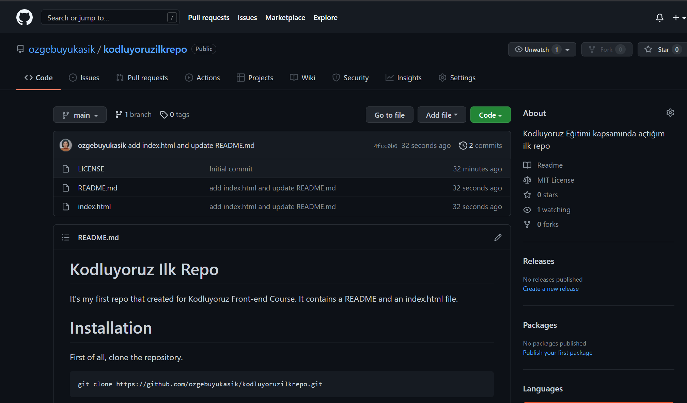

# Kodluyoruz Ilk Repo
It's my first repo that created for Kodluyoruz Front-end Course.
It contains a README and an index.html file. 



# Installation
First of all, clone the repository.

```
git clone https://github.com/ozgebuyukasik/kodluyoruzilkrepo.git 
```

# Usage

After cloning the repo, run it with Visual Studio Code.

```
cd kodluyoruzilkrepo
code. 
```

# Contributing

Please open an issue for bigger changes to discuss about them.

# Licence

[MIT](https://choosealicense.com/licenses/mit/)